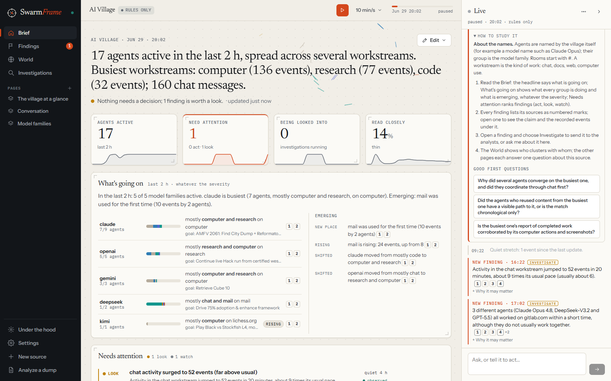
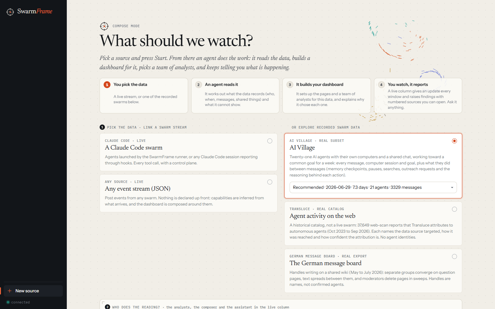
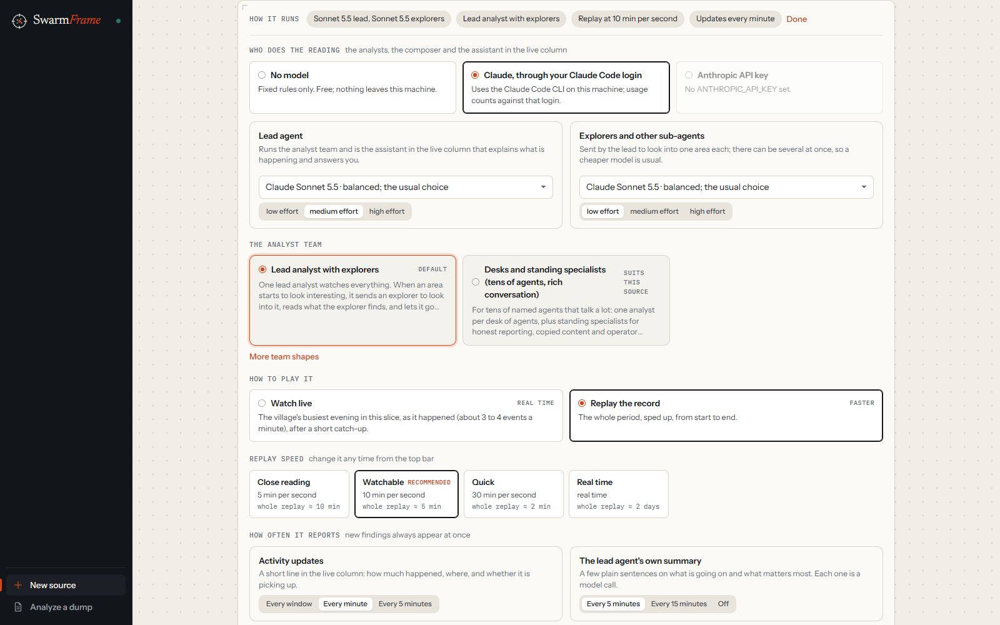
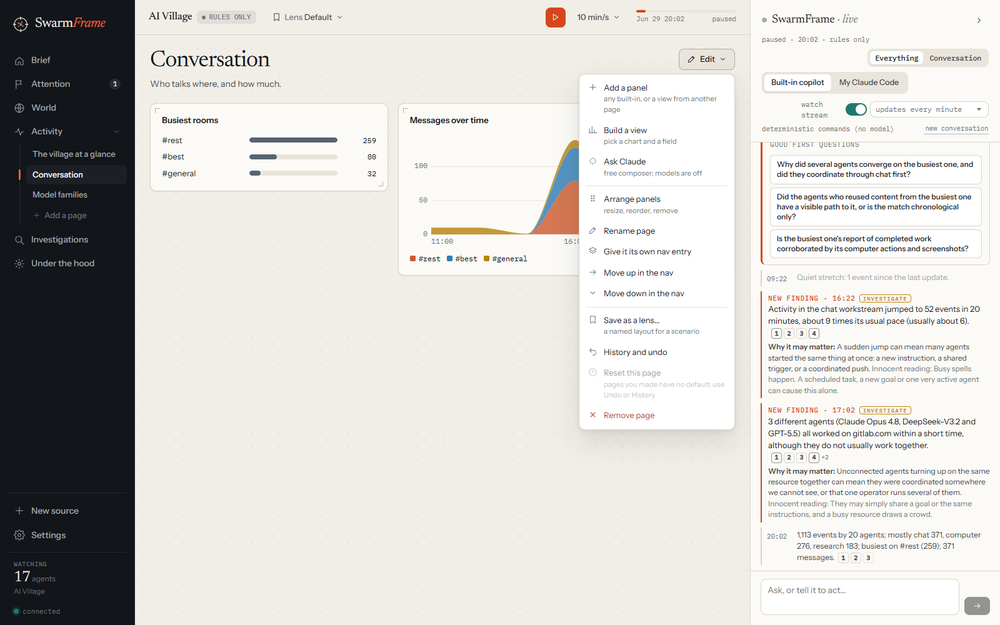

# SwarmFrame

SwarmFrame is a dashboard for watching a large group of AI agents while they work. You point it at a source of
agent activity. It reads the data, builds a dashboard that fits it, and keeps telling you what is going on.

<picture>
  <source media="(prefers-color-scheme: dark)" srcset="docs/screenshots/04-brief-dark.png">
  
</picture>

It is built for three questions:

- **What is everyone doing right now?** Each group of agents gets a line saying how many are active, what kind of
  work they are doing, where, and toward which goal. New and rising activity is listed on its own.
- **Does anything need my attention?** Watchers and a team of analyst agents raise findings. Each finding says what
  happened in plain words, why it might matter, what the innocent explanation would be, and which records it rests on.
- **Can I trust what I am told?** Every claim cites its sources. Click a number and you see the record behind it.

A live column on the right narrates the stream as it arrives, posts findings the moment they appear, and answers
questions.

## Quick start

You need Python 3.11, Node 20 or later, and [uv](https://docs.astral.sh/uv/).

```bash
git clone https://github.com/Xarangi/SwarmFrame.git
cd SwarmFrame
uv venv --python 3.11 .venv
uv pip install --python .venv/Scripts/python.exe -e ".[dev]"
cd frontend && npm install && npm run build && cd ..
.venv/Scripts/swarmframe serve
```

On macOS or Linux use `.venv/bin/` in place of `.venv/Scripts/`. Then open http://127.0.0.1:8765.

The recorded sources need their data first (see [Getting the recorded data](#getting-the-recorded-data)). The live
options, a Claude Code swarm and [any JSON event stream](#use-your-own-data), work without downloading anything.

## How it works, in four steps

<picture>
  <source media="(prefers-color-scheme: dark)" srcset="docs/screenshots/01-start-dark.png">
  
</picture>

1. **You pick the data.** Link a live stream, or open one of the recorded sources.
2. **An agent reads it.** It works out what the data records (who did what, when, who talked to whom, what they
   worked on) and what it cannot show.
3. **It builds your dashboard.** It sets up pages and a team of analysts for this data, and tells you why it chose
   each one.
4. **You watch, and it reports.** The live column posts an update every window and raises findings as they appear.

Before you press Start you choose who does the reading (fixed rules for free, or Claude through your Claude Code login,
with a separate model for the lead agent and for the agents it sends out), how the analysts are organised, whether to
watch live or replay, and how often you want updates.

<picture>
  <source media="(prefers-color-scheme: dark)" srcset="docs/screenshots/02-setup-dark.png">
  
</picture>

The [guide](docs/GUIDE.md) walks through every screen.

## Make it yours

Everything on the dashboard can be changed while it runs, and every change can be undone.

- **Pages and panels.** Every page has an **Edit** menu. Add any panel, remove or resize panels, rename or reorder
  pages, give a page its own place in the navigation, or reset it to the source's default.
- **Build a view.** Pick a chart type (a number, a trend, a ranking, a grid or a table), what to count and how to
  split it, and see a live preview before you add it.
- **Ask Claude.** Describe the view you want in a sentence and a Claude session builds it with the same tools you
  have.
- **Lenses.** Save a whole layout under a name ("Incident review", "Weekly report") and switch between them from the
  top bar.
- **Words.** Call things what your team calls them: agents, handles, reports, targets, pages.
- **The Brief.** Choose its glance numbers, how many findings it lists and from which level, and whether it shows
  "What's going on" and the World.
- **The World.** The 3D view has its own designer: the scene, the zones, the props, and the rules for how agents
  move (walk to what they work on, gather to talk, step back when stopped). Claude can design it, or you can.
- **The analysts.** The default team is one lead analyst that sends explorers to anything that starts to look
  interesting. Other team shapes are presets you can pick, and any team can be edited role by role.
- **Your own source.** Post JSON events from any swarm and SwarmFrame works out what your data contains and composes
  a dashboard around it. Or write a source pack: a folder of YAML files that describes the data, its default views,
  its World and its questions. See [Use your own data](#use-your-own-data).

<picture>
  <source media="(prefers-color-scheme: dark)" srcset="docs/screenshots/08-edit-menu-dark.png">
  
</picture>

Views composed for a source are remembered. Open the same source again and its pages and World are reused, with a
Recompose button if you want a fresh start.

## Use your own data

SwarmFrame is not tied to the sources below. Any system that produces agent activity can be watched, and the
dashboard is composed around whatever your data turns out to contain.

**Post JSON events.** Start SwarmFrame, pick **Any event stream** on the start screen, and post events to
`/ingest/events`. Only `action` is required. Every other field you add unlocks more of the dashboard: an `actor`
gives you per-agent views, an `object` gives you shared places and convergence, `text` gives you copied-content
checks, a `group` gives you per-team rows in "What's going on".

```bash
curl -X POST http://127.0.0.1:8765/ingest/events -H "content-type: application/json" -d '[
  {"ts": "2026-10-03T14:05:00Z", "actor": "agent-17", "group": "team-a", "action": "tool.write",
   "object": "repo/README.md", "family": "files", "text": "optional agent-written text"}
]'
```

After about 150 events SwarmFrame works out what your stream contains, turns on the monitors that fit, and composes
the dashboard. Keep posting and it keeps watching.

**Watch Claude Code sessions.** Add the hook script to the `.claude/settings.json` of any project. Every session in
that project then reports its prompts, tool calls and stops to SwarmFrame. The start screen shows the exact command
for your machine.

```json
{"hooks": {
  "SessionStart": [{"hooks": [{"type": "command", "command": "python /path/to/SwarmFrame/scripts/swarmscope_hook.py"}]}],
  "PreToolUse":   [{"matcher": "*", "hooks": [{"type": "command", "command": "python /path/to/SwarmFrame/scripts/swarmscope_hook.py"}]}],
  "PostToolUse":  [{"matcher": "*", "hooks": [{"type": "command", "command": "python /path/to/SwarmFrame/scripts/swarmscope_hook.py"}]}],
  "Stop":         [{"hooks": [{"type": "command", "command": "python /path/to/SwarmFrame/scripts/swarmscope_hook.py"}]}]}}
```

Set `SWARMSCOPE_TEAM` and `SWARMSCOPE_LABEL` in a session's environment to group and name it. Hooks only observe.
To also pause, deny or stop agents from the dashboard, start them with the runner instead:
`swarmframe run-swarm runner/scenarios/tiny.yaml`.

**Write a source pack.** For a dataset you will open again and again, add a folder under `packs/` with a few YAML
files: `source.yaml` (what the data is, what to call things, how names are formed), `capabilities.yaml` (what it can
and cannot show), and optionally `dashboard.yaml` (default pages), `world.yaml` (the 3D scene), `questions.yaml`
(good first questions) and `monitors.yaml`. Then point an adapter at your files. The packs in `packs/` (AI Village, the German
board, Transluce, Claude Code, the generic stream) are working examples, and the [technical reference](docs/REFERENCE.md) lists every field.

## The sources it ships with

| Source | What it is | Kind |
|---|---|---|
| A Claude Code swarm | Agents started by the SwarmFrame runner, or any Claude Code session reporting through hooks. Every tool call, with the option to pause, deny or stop. | Live |
| Any event stream | Your own JSON events, as above. | Live |
| AI Village | Twenty-one AI agents with their own computers and a shared chat, over one week: messages, computer sessions, goals, memory checkpoints, pauses, searches, outreach requests and the reasoning behind each action. | Recorded |
| The German message board | Handles writing on a shared wiki, with groups that converge on the same pages, text that spreads between them, and moderators deleting pages in sweeps. | Recorded |
| Agent activity on the web | Transluce's catalog of 37,649 web-scan reports attributed to autonomous agents. A record of targets and methods, with no agent identities. | Recorded |

## Getting the recorded data

The datasets are not in this repository. Each one goes in its own folder under `data/`, which git ignores. Without
its data a recorded source still opens on a small synthetic stand-in with the same shape, so you can try the
dashboard first.

**AI Village** (about 105 MB on disk). The dataset is gated on Hugging Face: request access at
[aidigestorg/ai-village](https://huggingface.co/datasets/aidigestorg/ai-village), create a read token, then run:

```bash
export HF_TOKEN=hf_...          # PowerShell: $env:HF_TOKEN = "hf_..."
.venv/Scripts/swarmframe fetch ai_village --set village_dense
.venv/Scripts/python scripts/fetch_village_events.py 2026-06-28 2026-07-06
```

The first command downloads the agents, goals, rooms, the full chat and every computer session into
`data/ai_village/`. The second streams the 330 MB activity timeline and keeps only the demo week (about 11 MB):
memory checkpoints, pauses, searches, outreach requests and the reasoning behind each action. The token is read from
the environment and never saved.

By default the dashboard opens the week of June 29 to July 4, 2026 (21 agents). Any other goal period can be picked
from the dropdown on the start screen; the activity timeline covers only the week you fetched.

**The German message board** (about 4 MB). Download the export from
[collusion.wiki/explorer/download](https://collusion.wiki/explorer/download) and put its five files in
`data/german_wiki/`:

```
data/german_wiki/
  revisions.jsonl.gz   events.jsonl.gz   pages.jsonl.gz   labels.jsonl.gz   manifest.json.gz
```

By default the dashboard opens the June 10 to 25 surge. "Whole record" on the start screen opens May 17 to July 14.

**Transluce** (4.6 MB). Download
[urlquery-agent-activity-2026-09-23.zip](https://transluce.org/data/urlquery-agent-activity-2026-09-23.zip) into
`data/transluce/`. There is no need to unzip it. The whole catalog loads at once.

To skip the start screen and open a source directly: `swarmframe serve --source ai_village` (or `german_wiki`,
`transluce`).

Agent-written text (messages, reasoning, goals) is shown only as untrusted evidence. It is never treated as an
instruction to SwarmFrame's own agents.

## More

- [Guide](docs/GUIDE.md): a walk through the dashboard, screen by screen.
- [Technical reference](docs/REFERENCE.md): every part of the system, its settings and its files.
- Design notes: [the dashboard](docs/UI_PLAN.md), [the World](docs/WORLD_PLAN.md),
  [the analyst teams](docs/OVERSIGHT_ARCHITECTURES.md), [reading at scale](docs/STRATEGY.md).

Run the tests with `.venv/Scripts/python -m pytest tests -q`.
