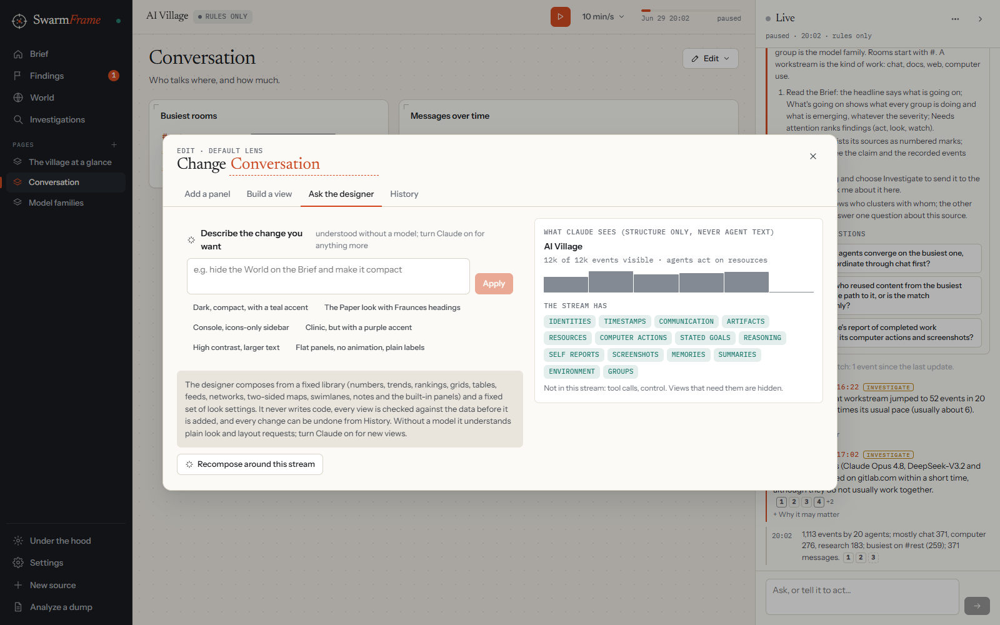
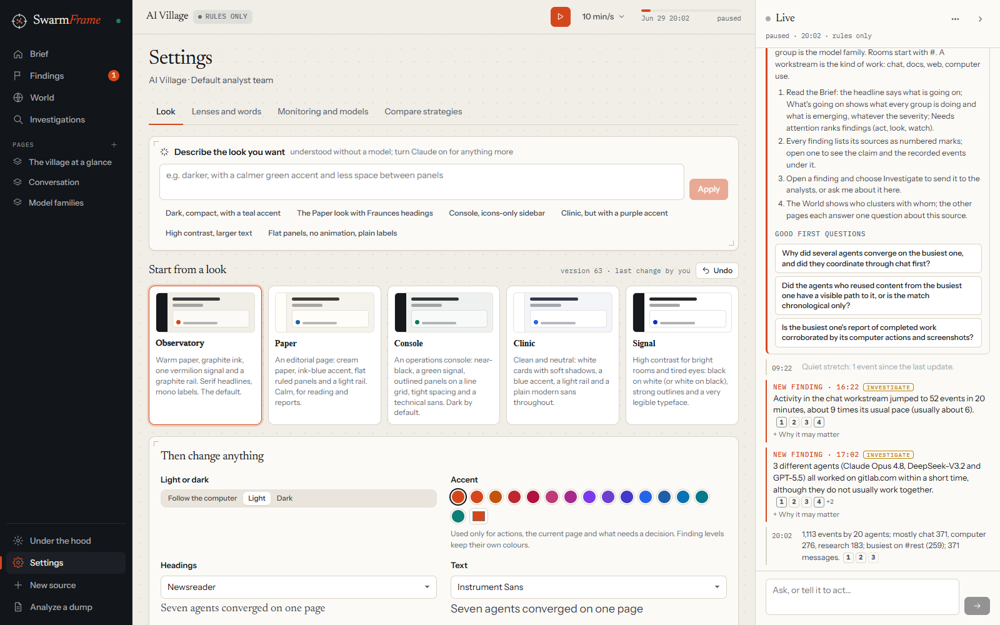
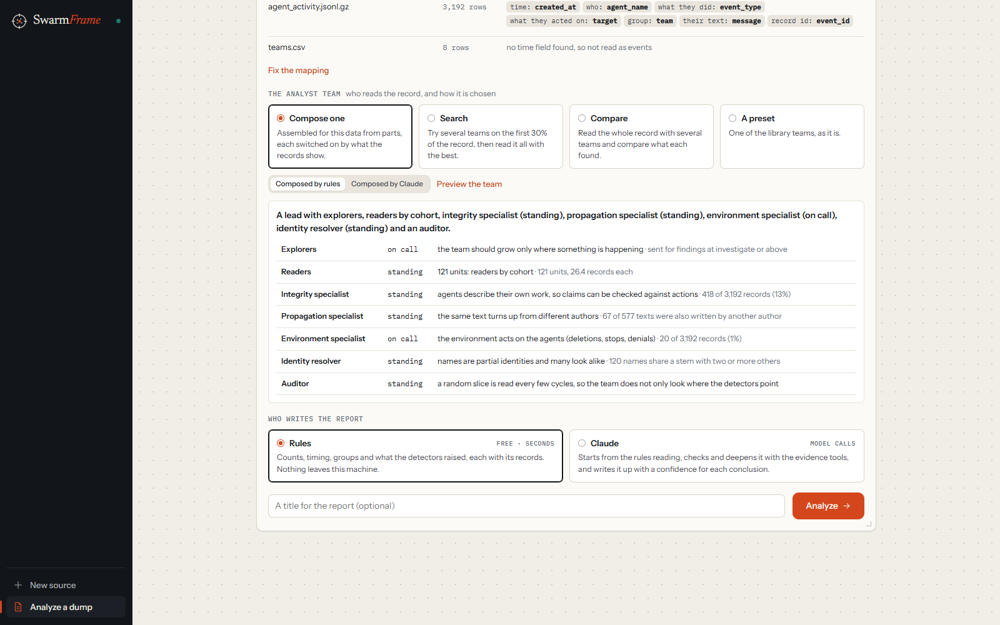
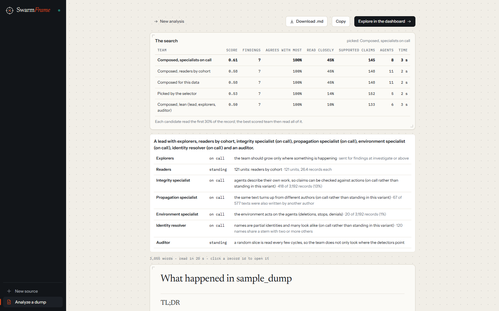

# A walk through SwarmFrame

This guide follows one session from start to finish, using the AI Village: twenty-one AI agents with their own
computers and a shared chat, working toward a common goal for a week. Then it shows how to change the look, how the
designer works, and the side mode for analysing a dump of logs after the fact. Each image follows your system theme
(light or dark) when viewed on GitHub.

## 1. Pick the data

<picture>
  <source media="(prefers-color-scheme: dark)" srcset="screenshots/01-start-dark.png">
  
</picture>

The start screen is one list. **Your own event stream** is the live option: post JSON from any system and
SwarmFrame works out what your stream contains from the first events that arrive. Below it are the recorded
sources. For the AI Village the recommended week is selected already.

Under the list, **How it runs** says in one line who does the reading, which analyst team, whether it plays live or
as a replay, and how often it reports. Press **Start** as it is.

## 2. Change how it runs (optional)

<picture>
  <source media="(prefers-color-scheme: dark)" srcset="screenshots/02-setup-dark.png">
  
</picture>

**Change** opens the choices:

- **Who does the reading.** "No model" runs on fixed rules. It is free and nothing leaves your machine. "Claude,
  through your Claude Code login" lets you pick a model and effort for the **lead agent** (it runs the analyst team
  and is the assistant in the live column) and for the **explorers** it sends out.
- **The analyst team.** The default is a lead analyst with explorers: when something starts to look interesting,
  the lead sends an explorer to look into it and lets it go when things calm down. Each source also suggests a team
  shape that suits it.
- **How to play it** and **replay speed.** Watch the busiest stretch in real time, or replay the whole record faster.
- **How often it reports.** An activity line every window, every minute or every five minutes, and, with a model on,
  a short summary from the lead agent.

## 3. Let it build the dashboard

<picture>
  <source media="(prefers-color-scheme: dark)" srcset="screenshots/03-composed-dark.png">
  
</picture>

SwarmFrame reads the data, loads the source's default views, adds a few pages of its own with the reason for each,
and lays out the World. The last step explains what it built: what this data can and cannot show, how names are
formed, who is reading it, how to study it, and some good first questions. Click a question to put it in the live
column's question box. A source set up before reuses its pages and World; **Recompose** starts fresh.

## 4. Read the Brief

<picture>
  <source media="(prefers-color-scheme: dark)" srcset="screenshots/04-brief-dark.png">
  
</picture>

The Brief is the home page. The rail on the left holds everything else: **Findings**, the **World**,
**Investigations**, then the pages built for this source, and at the bottom **Under the hood**, **Settings**,
**New source** and **Analyze a dump**.

- **The status line** says how many agents are active and what most of the work is.
- **The attention line** says whether anything needs a decision.
- **The glance numbers** show agents active, findings that need attention, investigations running, and how much of
  the activity the analysts have read closely. Click one to go to its page.

### What's going on

<picture>
  <source media="(prefers-color-scheme: dark)" srcset="screenshots/05-whats-going-on-dark.png">
  
</picture>

This section is there whether or not anything is wrong. Each group (here, each model family) gets a row: how many of
its agents are active, a bar of the kinds of work they do, where they work, the goal they stated themselves, and
whether that is new, rising, slowing or quiet. On the right, **Emerging** lists what is new.

### Needs attention

Findings are ranked by how much they need you: **act**, **look** or **watch**. Each says what happened in plain
words, what to do next, and lists its sources as numbered marks. A finding whose check found the innocent explanation
stays on watch and says so.

## 5. Open a finding

<picture>
  <source media="(prefers-color-scheme: dark)" srcset="screenshots/06-finding-dark.png">
  
</picture>

A finding opens in a side panel: what happened, why it might matter, the innocent reading, what to check, and its
sources: the claims the watchers and analysts made, each followed by the recorded events under it. Agent-written
text, including an agent's private reasoning, is marked untrusted. From here you can send it to the analysts, show it
in the World, watch it more closely, pin, snooze or dismiss it.

## 6. Use the live column

The column on the right runs beside every page. It posts a short line about each stretch of activity, every new
finding (open "Why it may matter" for the reason and the innocent reading) and, with a model on, the lead agent's own
summary. Ask it anything in the box at the bottom; its answers cite their sources the same way findings do. The **⋯**
menu sets what it shows and how often it posts, and switches between the built-in assistant and your own Claude Code
session.

## 7. Look at the World

<picture>
  <source media="(prefers-color-scheme: dark)" srcset="screenshots/07-world-dark.png">
  
</picture>

The World is the swarm in 3D. Agents who talk in the same rooms and work on the same documents stand near each other.
**Legend** explains every movement and colour, with a live count of how many agents are doing each thing. Places and
props only set the scene; where an agent stands is always measured from what it did.

## 8. Change the pages

<picture>
  <source media="(prefers-color-scheme: dark)" srcset="screenshots/08-edit-menu-dark.png">
  
</picture>

Every page has an **Edit** menu: add a panel, build a view, ask the designer, change the look, rearrange panels,
rename or move the page, save the layout as a lens, look through the history, reset the page, or remove it. Every
change applies at once and shows an Undo button.

<picture>
  <source media="(prefers-color-scheme: dark)" srcset="screenshots/09-build-a-view-dark.png">
  
</picture>

**Build a view** lets you pick what to show (a number, a trend, a ranking, a grid, a table, the latest records, who
works with whom, a two-sided map or lanes over time), what to count, how to split it and over what time, with a live
preview from the current data. Click any bar, row, node or lane on a page to open the records behind it.

## 9. Ask the designer

<picture>
  <source media="(prefers-color-scheme: dark)" srcset="screenshots/10-designer-dark.png">
  
</picture>

Describe what you want in a sentence. The designer is constrained on purpose: it builds only from the same library of
views you have and a fixed set of look settings, every view is run against your data before it is added, every
colour is checked for readable text in light and dark, and the colours that carry meaning (finding levels, evidence
status) cannot change. It never writes code. With Claude on, a Claude session makes the change and reports in the
live column; without a model, plain requests ("hide the World, compact, a teal accent") still work, and it says what
it understood.

## 10. Change the look

<picture>
  <source media="(prefers-color-scheme: dark)" srcset="screenshots/12-look-dark.png">
  
</picture>

**Settings → Look** starts from one of five looks:

- **Observatory**, the default: warm paper, graphite ink, one vermilion signal, serif headlines.
- **Paper**: an editorial page with an ink-blue accent and flat ruled panels, for reading and reports.
- **Console**: near-black with a green signal, outlined panels on a line grid, tight spacing.
- **Clinic**: white cards with soft shadows, a blue accent and a plain modern sans.
- **Signal**: high contrast, strong outlines and a very legible typeface.

Then change anything: light or dark, the accent, the typefaces for headings, text and numbers, density, corners,
panels, the background, the rail (dark or matching the page, names or icons only), headlines, labels and motion. Or
describe the look in the box at the top. **Undo** steps back through every change.

## 11. See how the oversight works

<picture>
  <source media="(prefers-color-scheme: dark)" srcset="screenshots/11-under-the-hood-dark.png">
  
</picture>

**Under the hood** shows the machinery: what the analysts plan to read, the groups of agents that behave alike, what
has been read and what has not, the analyst team, the health of each monitor, where the effort goes, what SwarmFrame
currently believes, and what it has cost. Any of these can be put on a page from Edit.

## 12. Analyze a dump

<picture>
  <source media="(prefers-color-scheme: dark)" srcset="screenshots/13-analyze-dark.png">
  
</picture>

For logs you already have, **Analyze a dump** reads them after the fact. Point it at a folder or a file, drop files
in, or use the sample. It shows what it found in each file and which field it takes as the time, who acted, what
they did, what they acted on, their group and their text; **Fix the mapping** corrects a guess. Choose who writes the
analyst team: **Compose one** for this data (Preview the team shows each part and why it is there), **Search**
(several teams try the first 30% of the record and the best reads it all), **Compare** (several teams each read the
whole record, side by side) or **A preset**. Then choose who writes the report: **Rules** (free, seconds) or **Claude**, which starts from the rules reading, investigates in rounds with the
evidence tools (reading what was written, searching the text, following text that spread) and writes it up.

<picture>
  <source media="(prefers-color-scheme: dark)" srcset="screenshots/14-report-dark.png">
  
</picture>

After a search or a comparison the report opens with a table of the teams: what each found, how much of it most
teams agree on, how much of the record each read closely, its supported claims, agents and time; **show report**
switches to that team's report. The report has a TL;DR, a timeline in which every line names its records, then the
analysis. Click a record id to
open it. **Download .md** saves it; **Explore in the dashboard** opens the whole analysis with every page, the World
and the evidence drawer. The same thing from the command line: `swarmframe analyze path/to/logs --out report.md`.

## Where to go next

- Link your own swarm: any system that can post JSON. The README's
  [Use your own data](../README.md#use-your-own-data) section has the format, with examples.
- Turn on Claude in step 2 and compare its findings and summaries with the rules-only run.
- Read the [technical reference](REFERENCE.md) for every setting, file and API, including how to score a report
  against MessageBoardAuditBench.
