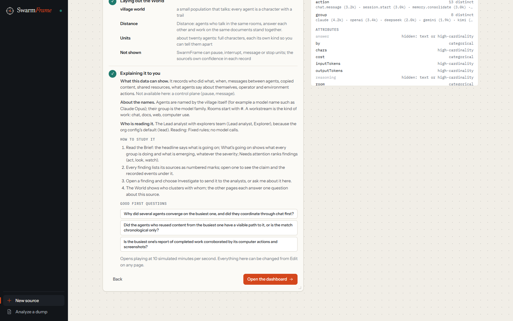
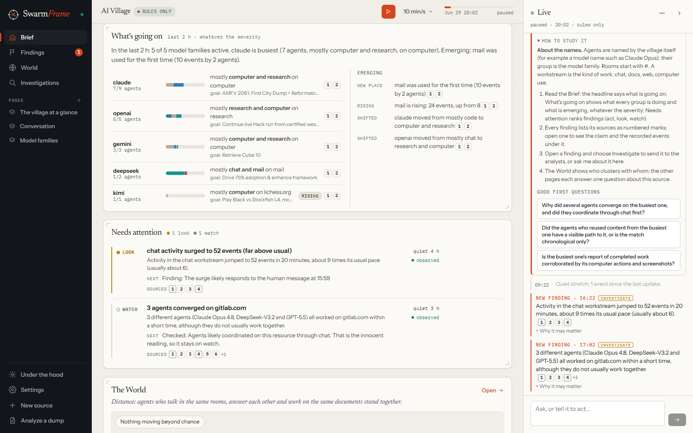
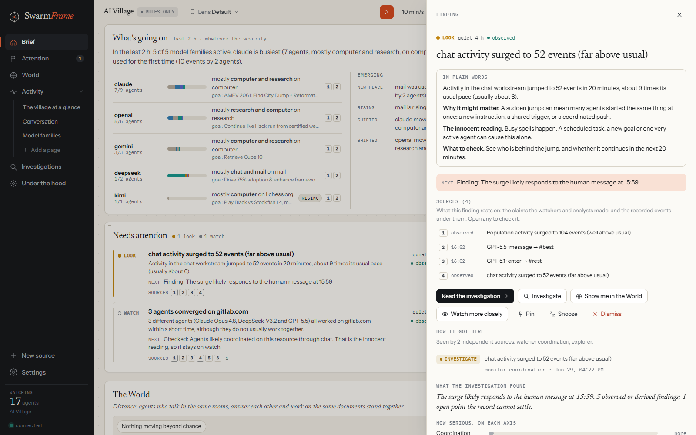
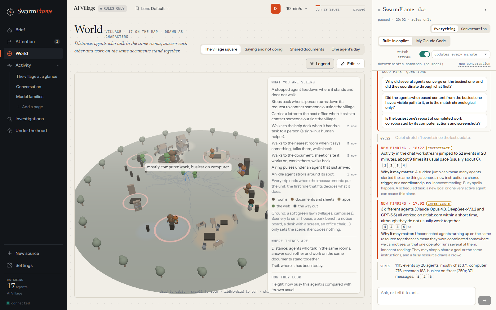
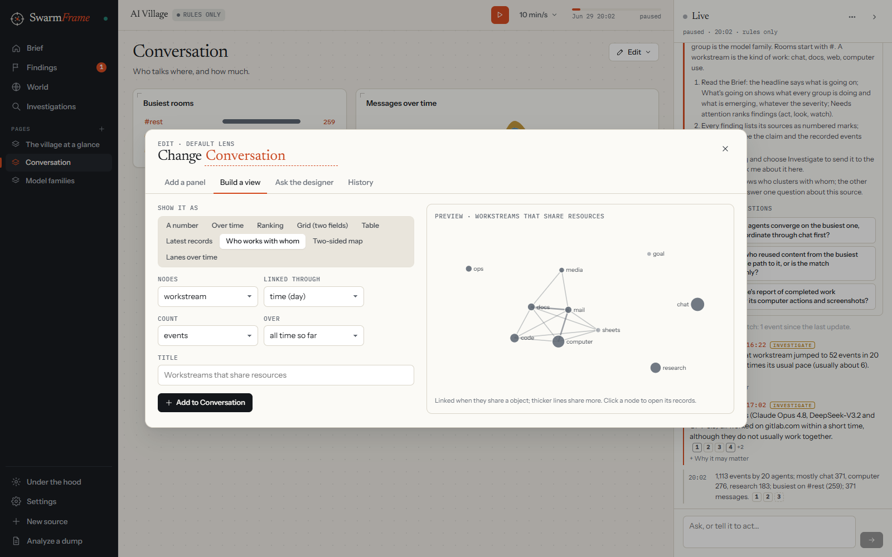
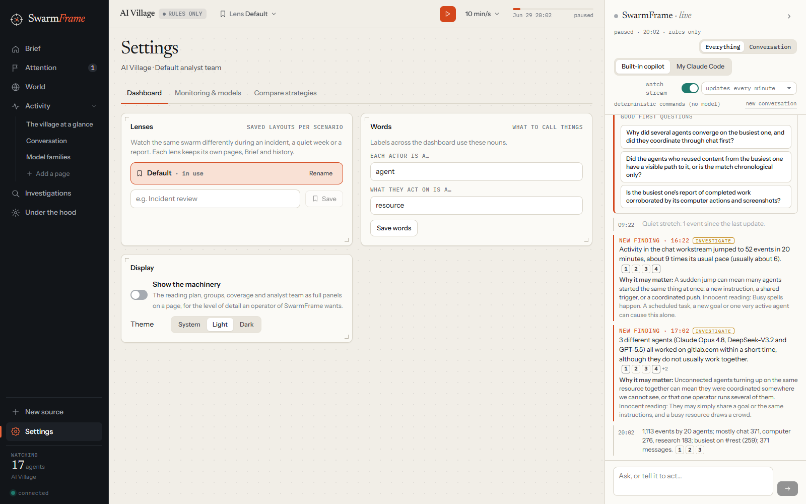
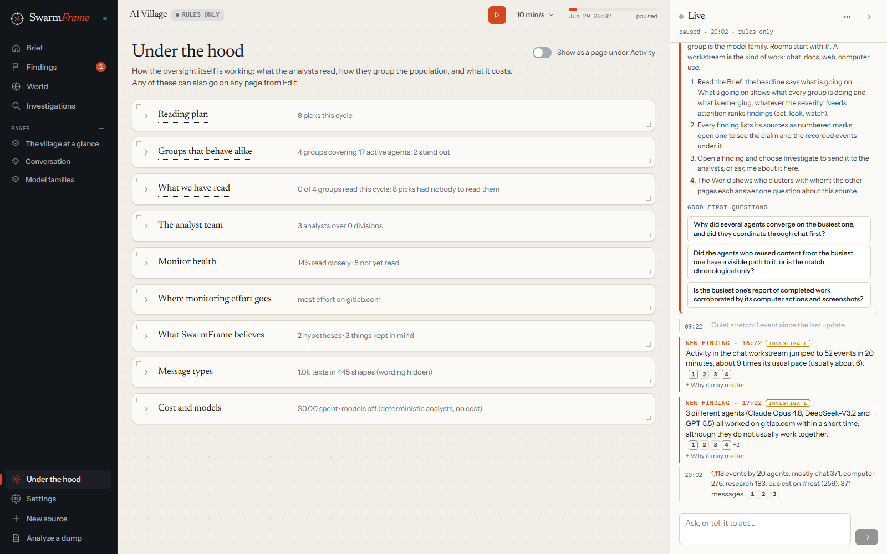

# A walk through SwarmFrame

This guide follows one session from start to finish, using the AI Village: twenty-one AI agents with their own
computers and a shared chat, working toward a common goal for a week. Every screenshot is from that run. Each image
follows your system theme (light or dark) when viewed on GitHub.

## 1. Pick the data

<picture>
  <source media="(prefers-color-scheme: dark)" srcset="screenshots/01-start-dark.png">
  
</picture>

The start screen lists the four steps of a session at the top. Below them are the sources.

On the left is the live option, **Any event stream**: post JSON from any system and SwarmFrame works out what
your stream contains from the first events that arrive.

On the right are the recorded sources. For the AI Village the recommended week is selected already.

## 2. Choose how it reads

<picture>
  <source media="(prefers-color-scheme: dark)" srcset="screenshots/02-setup-dark.png">
  
</picture>

- **Who does the reading.** "No model" runs on fixed rules. It is free and nothing leaves your machine.
  "Claude, through your Claude Code login" lets you pick a model and effort for the **lead agent** (it runs the
  analyst team and is the assistant in the live column) and for the **explorers** it sends out.
- **How the analysts are organised.** The default is a lead analyst with explorers. When something starts to look
  interesting, the lead sends an explorer to look into it and lets it go when things calm down. Each source also
  suggests a preset that suits it, and more presets are one click away.
- **How to play it.** Watch the busiest stretch in real time, or replay the whole record faster.
- **How often it reports.** An activity line every window, every minute or every five minutes, and, with a model on,
  a short summary from the lead agent every five or fifteen minutes.

The line under the Start button says in one sentence what will happen with your choices.

## 3. Let it build the dashboard

<picture>
  <source media="(prefers-color-scheme: dark)" srcset="screenshots/03-composed-dark.png">
  
</picture>

SwarmFrame reads the data, loads the source's default views, adds a few pages of its own with the reason for each,
and lays out the World. The last step explains what it built: what this data can and cannot show, how names are
formed, who is reading it, how to study it, and some good first questions. Click a question to put it in the live
column's question box.

If this source was set up before, its pages and World are reused and nothing is recomputed. Use **Recompose** for a
fresh start.

## 4. Read the Brief

<picture>
  <source media="(prefers-color-scheme: dark)" srcset="screenshots/04-brief-dark.png">
  
</picture>

The Brief is the home page. From the top:

- **The status line** says how many agents are active and what most of the work is.
- **The attention line** says whether anything needs a decision.
- **The glance numbers** show agents active, findings that need attention, investigations running, and how much of
  the activity the analysts have read closely. Click one to go to its page.

### What's going on

<picture>
  <source media="(prefers-color-scheme: dark)" srcset="screenshots/05-whats-going-on-dark.png">
  
</picture>

This section is there whether or not anything is wrong. Each group (here, each model family) gets a row: how many of
its agents are active, a bar of the kinds of work they do, where they work, the goal they stated themselves, and
whether that is new, rising, slowing or quiet. On the right, **Emerging** lists what is new: places used for the first
time, work that is new or rising, groups that changed what they are doing.

### Needs attention

Findings are ranked by how much they need you: **act**, **look** or **watch**. Each one says what happened in plain
words, what to do next, and lists its sources as numbered marks. A finding whose check found the innocent explanation
stays on watch and says so.

## 5. Open a finding

<picture>
  <source media="(prefers-color-scheme: dark)" srcset="screenshots/06-finding-dark.png">
  
</picture>

A finding opens in a side panel:

- **In plain words.** What happened, why it might matter, the innocent reading, and what to check.
- **Sources.** The claims the watchers and analysts made, each followed by the recorded events under it. Click any of
  them to see the record itself. Agent-written text, including an agent's private reasoning, is marked untrusted.
- **Actions.** Investigate (sends it to the analysts), show it in the World, watch more closely, pin, snooze or dismiss.
- **How it got here.** Which watchers and analysts saw it, and each change of level.

## 6. Use the live column

The column on the right runs beside every page. It posts a short line about each stretch of activity, every new
finding with its explanation and sources, and, with a model on, the lead agent's own summary. Ask it anything in the
box at the bottom. Its answers cite their sources the same way findings do, and an answer that cites nothing is
labelled as interpretation. The selector at the top sets how often it posts.

## 7. Look at the World

<picture>
  <source media="(prefers-color-scheme: dark)" srcset="screenshots/07-world-dark.png">
  
</picture>

The World is the swarm in 3D. Agents who talk in the same rooms and work on the same documents stand near each other.
In the AI Village, rooms, documents, apps, the web and the way out of the village each have their own area, and agents
walk out to what they are working on, gather in a room when they talk, carry a letter to the post office when they ask
to contact someone outside, and step back when a person turns that down. A ring on the ground marks a place that is
busier than usual.

**Legend** explains every movement and colour, with a live count of how many agents are doing each thing. The tabs at
the top are saved camera views. Click any agent or place to open it.

Places and props only set the scene. Where an agent stands is always measured from what it did.

## 8. Change anything

<picture>
  <source media="(prefers-color-scheme: dark)" srcset="screenshots/08-edit-menu-dark.png">
  
</picture>

Every page has an **Edit** menu. From it you can add a panel, build a new view, ask Claude to change the page,
rearrange panels, rename or move the page, save the layout as a lens, look through the history, reset the page, or
remove it. Every change applies at once and shows an Undo button.

<picture>
  <source media="(prefers-color-scheme: dark)" srcset="screenshots/09-build-a-view-dark.png">
  
</picture>

**Build a view** lets you pick a chart type, what to count, how to split it and over what time, and shows a live
preview from the current data before you add it.

<picture>
  <source media="(prefers-color-scheme: dark)" srcset="screenshots/10-settings-dark.png">
  
</picture>

**Settings** holds your lenses (named layouts you can switch between from the top bar), the words the dashboard uses
for agents and the things they act on, the theme, and the monitoring and model settings.

## 9. See how the oversight works

<picture>
  <source media="(prefers-color-scheme: dark)" srcset="screenshots/11-under-the-hood-dark.png">
  
</picture>

**Under the hood** shows the machinery: what the analysts plan to read, the groups of agents that behave alike, what
has been read and what has not, the analyst team, the health of each monitor, where the effort goes, what SwarmFrame
currently believes, and what it has cost. Any of these can be put on a page from Edit.

## Where to go next

- Link your own swarm: a Claude Code project's hooks, or any system that can post JSON. The README's
  [Use your own data](../README.md#use-your-own-data) section has both, with examples.
- Turn on Claude in step 2 and compare its findings and summaries with the rules-only run.
- Read the [technical reference](REFERENCE.md) for every setting, file and API.
